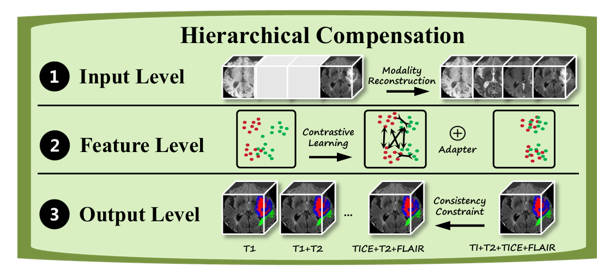
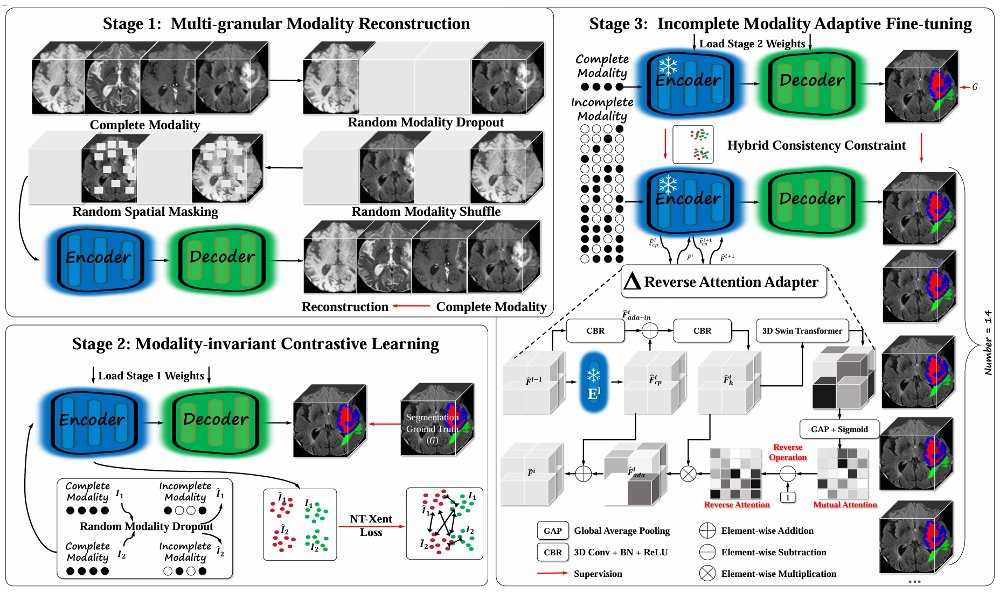

# UniMRSeg

**UniMRSeg: Unified Modality-Relax Segmentation via Hierarchical Self-Supervised Compensation** [[Paper]](https://arxiv.org/pdf/2509.16170) 
<br>_Xiaoqi Zhao, Youwei Pang, Chenyang Yu, Lihe Zhang, Huchuan Lu, Shijian Lu, Georges El Fakhri, Xiaofeng Liu_<br>
In NeurIPS 2025

## Motivation
|  Hierarchical Compensation |
| --- |
|  |
- The performance with arbitrary modality combinations approaches that of the full modality input.
- Our approach hierarchically bridges representation gaps between complete and incomplete modalities across input, feature and output levels.

## Framework
|  Multi-stage Learning Framework |
| --- |
|  |

- Stage1: complete modality reconstruction based on multi-granular random perturbations.
- Stage2: modality-invariant contrastive learning for enhancing incomplete-modality representation.
- Stage3: incomplete modality adaptivefine-tuning via hybrid consistency constraints

## Data
  - BraTS 2020
  - NJUD, NLPR, STERE.
  - VT5000, VT1000
  - SUN-RGBD

## Training
1. Stage 1:
``` commandline
python main-ssl1.py --logdir=log_train_unimrseg_ssl1 --fold=0 --json_list=./brats2020_datajson_paper.json --max_epochs=300 --lrschedule=warmup_cosine --val_every=10 --data_dir=/BraTS2020_Data/  --out_channels=3 --batch_size=2 --infer_overlap=0.5
```
--data_dir is the location of the data.

2. Stage 2:
Load the ssl1 weights and run main-ssl2.py
``` commandline
python main-ssl2.py --checkpoint /model_final_ssl1.pt --logdir=log_train_unimrseg_ssl2 --fold=0 --json_list=./brats2020_datajson_paper.json --max_epochs=300 --lrschedule=warmup_cosine --val_every=10 --data_dir=/BraTS2020_Data/  --out_channels=3 --batch_size=2 --infer_overlap=0.5
```
3. Stage 3:
Load the ssl2 weights and run main-ssl3.py
``` commandline
python main-ssl3.py --checkpoint /model_final_ssl2.pt --logdir=log_train_unimrseg_ssl3 --fold=0 --json_list=./brats2020_datajson_paper.json --max_epochs=300 --lrschedule=warmup_cosine --val_every=1 --data_dir=/BraTS2020_Data/  --out_channels=3 --batch_size=1 --infer_overlap=0.5
```

## Testing
``` commandline
python test.py --checkpoint /model_final_ssl3.pt --logdir=log_train_unimrseg_ssl3 --fold=0 --json_list=./brats2020_datajson_paper.json --max_epochs=300 --lrschedule=warmup_cosine --val_every=10 --data_dir=/BraTS2020_Data/  --out_channels=3 --batch_size=2 --infer_overlap=0.5
```

## Bi-modality Input Task
Please refer to the training configuration of [**SSLSOD**](https://github.com/Xiaoqi-Zhao-DLUT/SSLSOD) and make appropriate modifications to the current repository’s code.

## Citation

```bibtex
@inproceedings{UniMRSeg,
  title={UniMRSeg: Unified Modality-Relax Segmentation via Hierarchical Self-Supervised Compensation},
  author={Zhao, Xiaoqi and Pang, Youwei and Yu, Chenyang and Zhang, Lihe and Lu, Huchuan and Lu, Shijian and Fakhri, Georges El and Liu, Xiaofeng},
  booktitle={NeurIPS},
  year={2025}
```
